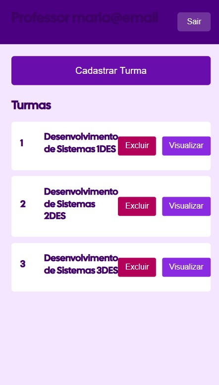
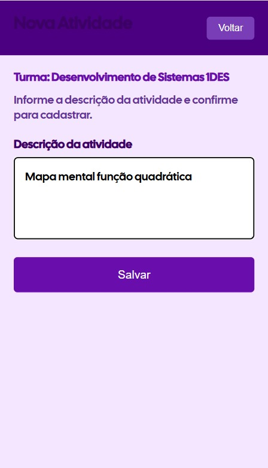

# Escola Mobile 📜

**Contextualização**: Na educação a falta de organização relacionada às atividades desenvolvidas pelos professores durante as aulas pode ocasionar problemas de gestão dos conhecimentos já trabalhados e avaliados. É fundamental, para que se possa atingir os objetivos educacionais, que os professores tenham controle sobre as atividades que serão aplicadas às turmas.
Muitas escolas situadas em áreas remotas do Brasil não possuem um sistema para solucionar essa falta de organização, acarretando prejuízos aos estudantes, professores e ao processo educacional como um todo.

## Tela de Login

## Tela de Turmas

## Tela de Cadastro de Turmas

## Tela de Atividades

## Tela de Cadastrar Atividades

